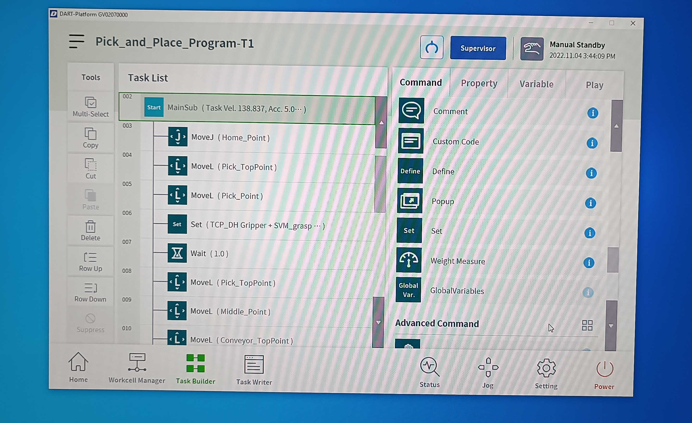
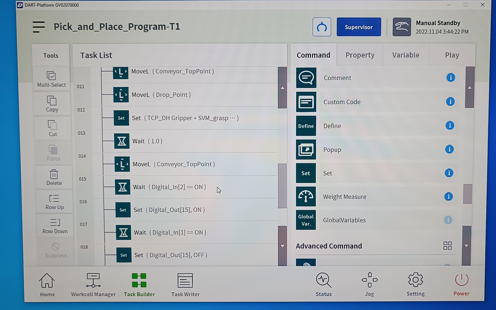
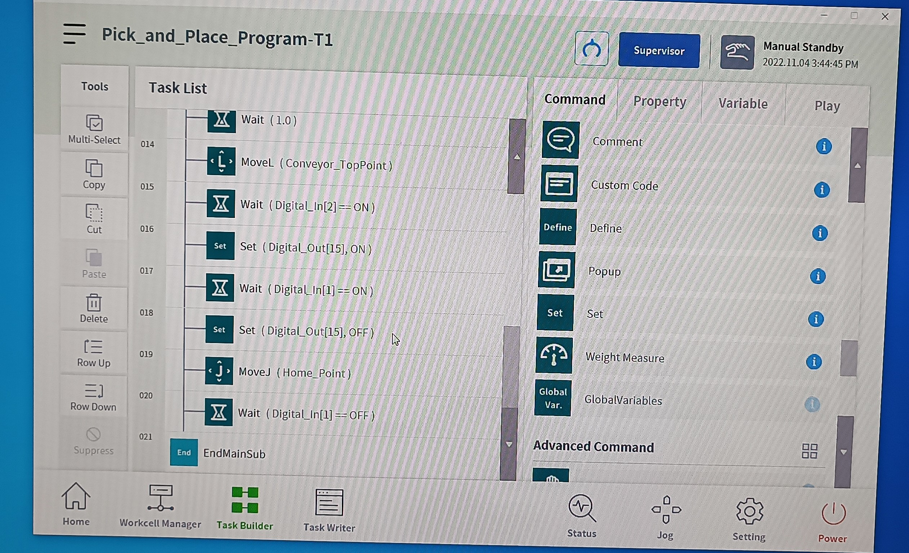
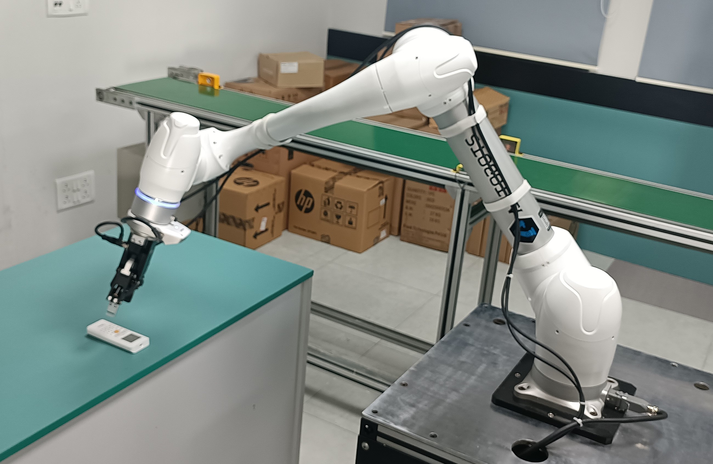
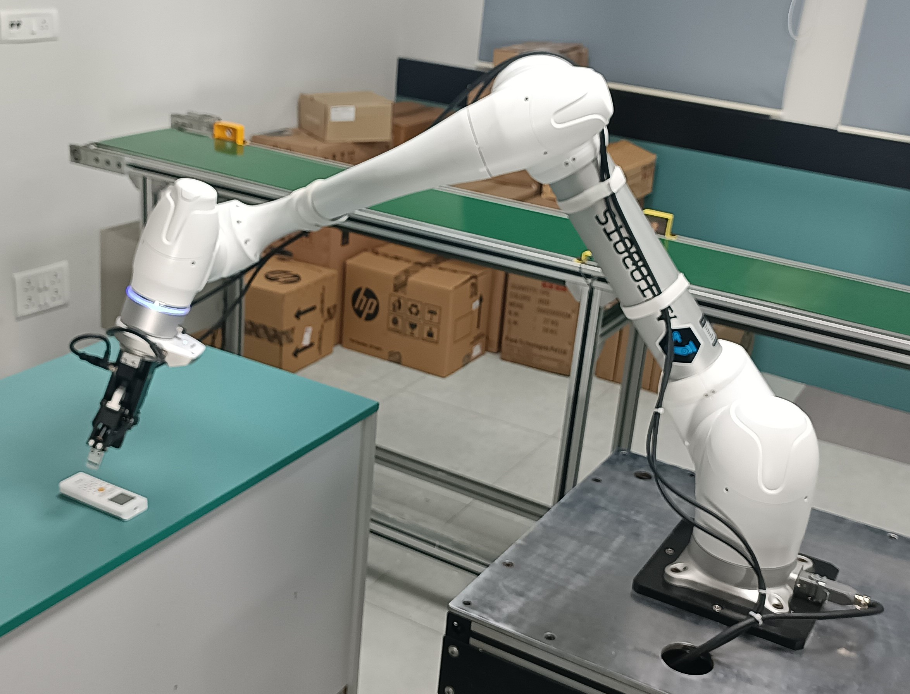

# Experiment-08-Pick-and-place-of-objects-using-industrial-manipulator-
JEEVA ABISHAKE
212221240018
### Aim :
To pick and place a regular shape using two finger gripper on the conveyor belt 
### Equipment Required: 
Instrial manipulator , teach pendant and associated program platform , two finger dh gripper 
      
### Theory: 

A pick and place robot has several dedicated parts, such as:

Robot Arm tool: A robotic arm, also known as a manipulator, is the extension of the robot by using cylindrical or spherical parts. links, and joints.

End Effector: The end effector is the accessory at the end of the robotic arm, that does the required job such as gripping objects. The end effectors can be designed to perform different functionalities based on requirements.

Actuators: Actuators create the motion in the robotic arm and end effectors. The linear actuators are basically any type of motor, such as servo motor, stepper motor, or hydraulic cylinder.

Sensors: You can think of sensors as the eyes of the robots. The sensors do the tasks like identifying the position of the object.

Controllers: Controllers synchronize and control the movement of different actuators of a robot, thereby being the brain behind the smooth robotic operation.

### Two finger gripper 

DH-Robotics
Adaptive Gripper AG-95 TM Kit
The AG-95 adaptive gripper is designed for multi-purpose gripping applications and can pick objects in different sizes and shapes without changing the end-of-arm tools, with a large stroke and adjustable gripping force. It’s also easy-to-use due to seamless integration with TM collaborative robots.

Through a plug-in installed in the TM flow, user could easily get full access to the control of gripper, including position and force control, as well as gripping detection. With such functions, DH-Robotics AG-95 gripper improves the gripping and manipulating capability of robots used in different scenarios such as machine tending, electronics/automobile components handling, medica, etc.

Plug & Play with TM robots
Integrated design, easy-to-use
Large stroke
Parallel & adaptive gripping
Gripping & drop detection
Force & position adjustment
Self-locking

### Figure -01 DH gripper with two finger gripper 

#### Specifications

Opening stroke	95mm
Gripping force 	45-160N
Recommended max payload	3kg*
Max closing speed	0.7s
Gripper Weight	1kg
Position repeatability	0.03mm
Supply voltage	24VDC±10%
Current	≤1.5A

### Doosan M1013 industrial collaborative robot manipulator 
Doosan Robotics designs collaborative robots for all types of operators, from engineers to teachers to designers of industrial robotics solutions. There are currently 4 robotic arms in the range, including this M1013 ROS robotic arm. With 6 degrees of freedom and a total reach of 1,300 mm, the Doosan M1013 Robotic Arm offers the speed and precision of execution necessary for all types of automated operation.

#### specifications 
Technical specifications of the Doosan Robotics M1013 arm:
Degrees of freedom: 6.
Payload: 10 kg.
Reach: 1,300 mm.
Tool speed: 1 m/s.
Repeatability: ±0.1 mm.
Operating temperature: 5–45 °C.
Weight: 33 kg.
Installation position: floor, ceiling, walls.

### Figure -02 Doosan M1013 industrial collaborative robot manipulator 

#### Procedure : 

1. click on dart platfom icon 
2. click on the internet interface 

and click on the connect icon .
### output video and screen shots of pick and place 
### program

### Robo Action:

### Results: 
Thus, the experiment to pick and place a regular shape using two finger gripper on the conveyor belt is sucessfully completed.

